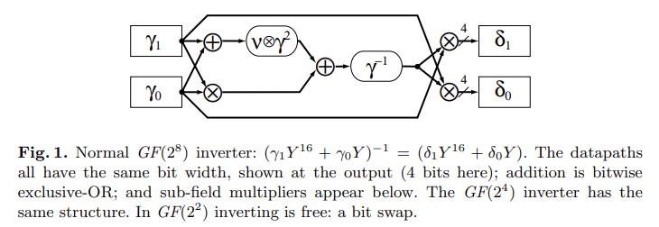
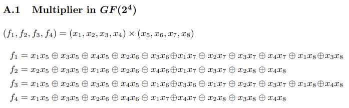

# AES S盒的复合域实现

## 参考资料
[FPGA and ASIC Implementations of AES](https://link.springer.com/chapter/10.1007/978-0-387-71817-0_10)<a href="#ref1">1</a>是《Cryptographic Engineering》的第十章，上面有一些关于S盒分解的图解，比较好理解。

[A Very Compact S-box for AES](https://iacr.org/archive/ches2005/032.pdf)<a href="#ref2">2</a>是发表在CHES2005年的文章。

[A very compact Rijndael S-box](https://core.ac.uk/download/pdf/36694529.pdf)<a href="#ref3">3</a>是上一篇文章的extended version。

## 参考实现
[Implementation-of-AES-SBOX](https://github.com/aretrosen/Implementation-of-AES-SBOX)<a href="#ref4">4</a>

[David Canright's tiny AES S-boxes](https://github.com/coruus/canright-aes-sboxes)<a href="#ref5">5</a>

## AES S盒表达式

AES 的S盒把一个8 bit向量 $\mathbf x=(x_7,\cdots,x_0)$ 映射为 $\mathbf y=(y_7,\cdots,y_0)$。

映射公式为$\mathbf y=A\mathbf x^{-1} + b$。展开来说，就是

\[
	\begin{bmatrix}
		y_7\\
		y_6\\
		y_5\\
		y_4\\
		y_3\\
		y_2\\
		y_1\\
		y_0\\
	\end{bmatrix}
	=
	\begin{bmatrix}
		1 & 1 & 1 & 1 & 1 & 0 & 0 & 0\\
		0 & 1 & 1 & 1 & 1 & 1 & 0 & 0\\
		0 & 0 & 1 & 1 & 1 & 1 & 1 & 0\\
		0 & 0 & 0 & 1 & 1 & 1 & 1 & 1\\
		1 & 0 & 0 & 0 & 1 & 1 & 1 & 1\\
		1 & 1 & 0 & 0 & 0 & 1 & 1 & 1\\
		1 & 1 & 1 & 0 & 0 & 0 & 1 & 1\\
		1 & 1 & 1 & 1 & 0 & 0 & 0 & 1\\
	\end{bmatrix}
	\begin{bmatrix}
		x_7\\
		x_6\\
		x_5\\
		x_4\\
		x_3\\
		x_2\\
		x_1\\
		x_0\\
	\end{bmatrix}^{-1}
	+
	\begin{bmatrix}
		0\\
		1\\
		1\\
		0\\
		0\\
		0\\
		1\\
		1\\
	\end{bmatrix}
\]

其中$b=0x63$，下标7代表最高比特位。这是[A Very Compact S-box for AES](https://iacr.org/archive/ches2005/032.pdf)<a href="#ref2">2</a>和[A very compact Rijndael S-box](https://core.ac.uk/download/pdf/36694529.pdf)<a href="#ref3">3</a>中的写法（本文称为小端比特序）。

如果把向量分量顺序反着写，就是

\[
	\begin{bmatrix}
		y_0\\
		y_1\\
		y_2\\
		y_3\\
		y_4\\
		y_5\\
		y_6\\
		y_7\\
	\end{bmatrix}
	=
	\begin{bmatrix}
		1 & 0 & 0 & 0 & 1 & 1 & 1 & 1\\
		1 & 1 & 0 & 0 & 0 & 1 & 1 & 1\\
		1 & 1 & 1 & 0 & 0 & 0 & 1 & 1\\
		1 & 1 & 1 & 1 & 0 & 0 & 0 & 1\\
		1 & 1 & 1 & 1 & 1 & 0 & 0 & 0\\
		0 & 1 & 1 & 1 & 1 & 1 & 0 & 0\\
		0 & 0 & 1 & 1 & 1 & 1 & 1 & 0\\
		0 & 0 & 0 & 1 & 1 & 1 & 1 & 1\\
	\end{bmatrix}
	\begin{bmatrix}
		x_0\\
		x_1\\
		x_2\\
		x_3\\
		x_4\\
		x_5\\
		x_6\\
		x_7\\
	\end{bmatrix}^{-1}
	+
	\begin{bmatrix}
		1\\
		1\\
		0\\
		0\\
		0\\
		1\\
		1\\
		0\\
	\end{bmatrix}
\]

这是[FPGA and ASIC Implementations of AES](https://link.springer.com/chapter/10.1007/978-0-387-71817-0_10)<a href="#ref1">1</a>和[A More Efficient AES Threshold Implementation](https://link.springer.com/content/pdf/10.1007/978-3-319-06734-6_17.pdf)<a href="#ref7">7</a>中的写法（本文称为大端比特序）。

## AES S盒复合域分解的原理
别看上一节的两个大公式中的上标 $^{-1}$ 所占的地方小，最难算的地方就是它了。目前有很多文献 <a href="#ref2">2</a>, <a href="#ref3">3</a>, <a href="#ref6">6</a>  研究如何实现这个求逆，即 $GF_2^8$ 上的求逆。

### $GF_2^8$ 有限域上元素的表示方法
关于 $GF_2^8$ 有限域上元素的表示可以参考文献 <a href="#ref6">6</a> 的introduction。可分为如下两类

**非冗余表示**

定义：which use m bits to represent each element of $GF_2^m$

  - PB: 多项式基表示，polynomial bases
  - NB: 标准基表示，normal bases
  - MB: 混合基表示，mixed bases

**冗余表示**

定义：which use n (> m) bits to represent each element of $GF_2^m$

  - Polynomial Ring Representation (PRR): 多项式环表示
  - Redundantly Represented Basis (RRB): 冗余基表示

目前在AES的门限实现研究中使用最多的表示方法来源于canright <a href="#ref2">2</a>,<a href="#ref3">3</a> 在2005年所做的工作，也是本文企图搞清楚的表示。作为工程师，咱们只讲怎么做，不讲为什么。因为讲为什么是科学家该干的事情。

canright在2005年发表的这篇文章考虑了432种基表示方法，包括了PB和NB，其中有一个最省资源的基表示，也可能是目前应用最广泛的一个基表示。这个基就是扩展版论文 <a href="#ref3">3</a> 中附录E的case 4。
### 基转换
前面已经说过$S$ 的公式为$\mathbf y=A\mathbf x^{-1} + b$。最耗资源的一步是$\mathbf x^{-1}$。如果不对$\mathbf x$ 做任何变换，直接计算可能是非常耗资源的，所以研究人员对如何优化$\mathbf x^{-1}$ 的计算过程进行了深入的研究。

canright 的最佳基就是将$\mathbf x$ 左乘一个矩阵$X^{-1}$ 得到 $\mathbf x' = X^{-1} \mathbf x$，再对$\mathbf x'$ 进行求逆，即得到$\mathbf x'^{-1}$。这时只需要将$\mathbf x'^{-1}$ 左乘矩阵$X$，就可以得到$\mathbf x^{-1}$。这个过程虽然绕了一个弯，但是它却更节省资源了。

绕的这个弯用公式来表达就是$\mathbf x^{-1} = X(X^{-1}\mathbf x)^{-1}$。

那么$S$ 盒的公式也就相应地变成了 $\mathbf y=(AX)(X^{-1}\mathbf x)^{-1} + b$。那么$S$ 盒的实现就变成了如下四步：

  - 利用$X$ 将输入$\mathbf x$ 进行线性变换得到$\mathbf x'$ 
  - 计算$\mathbf x'^{-1}$ （这一步的细节将在下一节说明）
  - 将$\mathbf x'^{-1}$ 左乘 $AX$
  - 加上常数 $b$.
  
  其中矩阵 $X^{-1}$ 为

\[
  	\begin{bmatrix}
			1 & 1 & 1 & 0 & 0 & 1 & 1 & 1 \\
			0 & 1 & 1 & 1 & 0 & 0 & 0 & 1 \\
			0 & 1 & 1 & 0 & 0 & 0 & 1 & 1 \\
			1 & 1 & 1 & 0 & 0 & 0 & 0 & 1 \\
			1 & 0 & 0 & 1 & 1 & 0 & 1 & 1 \\
			0 & 0 & 0 & 0 & 0 & 0 & 0 & 1 \\
			0 & 1 & 1 & 0 & 0 & 0 & 0 & 1 \\
			0 & 1 & 0 & 0 & 1 & 1 & 1 & 1 \\
		\end{bmatrix}
\]

矩阵 $AX$ 为

\[
	\begin{bmatrix}
		0 & 0 & 1 & 0 & 1 & 0 & 0 & 0 \\
		1 & 0 & 0 & 0 & 1 & 0 & 0 & 0 \\
		0 & 1 & 0 & 0 & 0 & 0 & 0 & 1 \\
		1 & 0 & 1 & 0 & 1 & 0 & 0 & 0 \\
		1 & 1 & 1 & 1 & 1 & 0 & 0 & 0 \\
		0 & 1 & 1 & 0 & 1 & 1 & 0 & 1 \\
		0 & 0 & 1 & 1 & 0 & 0 & 1 & 0 \\
		0 & 1 & 0 & 1 & 0 & 0 & 1 & 0 \\
	\end{bmatrix}
\]

### S盒复合域分解图解和ANF公式
canright 论文中的best case，也就是case 4，用的标准基，而利用标准基进行分解的图解（来源于文献 <a href="#ref2">2</a>）如下所示，这也是$\mathbf x'^{-1}$ 计算方法。我们不需要搞清楚这些符号代表什么意思。相反地，我们仅需知道每个符号的输入是什么，这些输入经过什么样的运算能够得到输出就行了。

图1

在图1中，方框表示的是数据，例如 $\gamma_1 = (x_7, x_6, x_5, x_4) ,\gamma_0 = (x_3, x_2, x_1, x_0)$ 和 $\delta_1 = (y_7, y_6, y_5, y_4),\delta_0 = (y_3, y_2, y_1, y_0)$ 四个数据在的方框。值得注意的是，在canright的论文中，高位（大索引）总是优先的。不管是前面的公式里，还是图里，索引大的总是出现在前方，这对于编程人员是很友好的。我就是因为不清楚高比特和低比特才写的这篇文章。

除方框外其他的形状表示操作。图中共有7个操作，两个四百米跑道，两个 $\oplus$ 和三个 $\otimes$ 。

**先看$\oplus$ 和第一个四百米跑道**。$\oplus$ 是按位异或，结果是 $\gamma = (y_7+y_3, y_6 + y_2, y_5 + y_1, y_4 + y_0)$。$\gamma$ 随后送到四百米跑道执行SquaeScale操作，也就是先把$\gamma$ 平方一下得到$\gamma^2$, 再乘一个数$\upsilon$，最终得到$\upsilon\gamma^2$。

我们把$\oplus$ 和$\upsilon\gamma^2$ 合并为一个函数，那这个函数以$\gamma_1 = (x_7, x_6, x_5, x_4) ,\gamma_0 = (x_3, x_2, x_1, x_0)$ 为输入，输出的四比特我们记为$\tau = (t_3,t_2,t_1, t_0)$，则
$\upsilon\gamma^2\circ\oplus$ （其中$\circ$ 表示functional composition）的表达式如下。

\[
	\begin{align*}
	  &t_3 = x_0 + x_2 + x_4 + x_6;\\
		&t_2 = x_1 + x_5 + x_3 + x_7;\\
		&t_1 = x_0 + x_1 + x_4 + x_5;\\
		&t_0 = x_0 + x_4;\\
	\end{align*}
\]

 $\oplus$ 和第一个四百米跑道正下方的操作是 $\otimes$，也就是$GF_2^4$ 上的乘法。这个乘法的输入是$\gamma_1 = (x_7, x_6, x_5, x_4) ,\gamma_0 = (x_3, x_2, x_1, x_0)$，输出的四比特记为$\tau = (t_3,t_2,t_1, t_0)$。

 实际上canright会对$GF_2^4$ 上的乘法继续分解到$GF_2^2$ 上，并进一步分解到$GF_2$ 上成为比特级别的操作。但是本文并不考虑继续细分，而是企图得到$GF_2^4$ 上乘法输出四比特和输入四比特之间的表达式关系。

 这个表达式可以参考[A More Efficient AES Threshold Implementation](https://link.springer.com/content/pdf/10.1007/978-3-319-06734-6_17.pdf)<a href="#ref7">7</a>，如图2所示。值得注意的是，这篇文章采用的大端比特序，即lsb（最低比特位）的索引更大。在图二的表达式中，索引从1开始，$x_8$ 代表lsb。
 
 
 
图2

转化为本文索引从0开始，$x_0$ 代表lsb的公式（小端公式）则为：

\[
	\begin{align*}
	    &t_3  =  x_7 x_3 + x_5 x_3 + x_4 x_3 + x_6 x_2 + x_5 x_2 + x_7 x_1 + x_6 x_1 + x_5 x_1 + x_4 x_1 + x_7 x_0 + x_5 x_0;\\
			&t_2  =  x_6 x_3 + x_5 x_3 + x_7 x_2 + x_6 x_2 + x_4 x_2 + x_7 x_1 + x_5 x_1 + x_6 x_0 + x_4 x_0;\\
			&t_1  =  x_7 x_3 + x_6 x_3 + x_5 x_3 + x_4 x_3 + x_7 x_2 + x_5 x_2 + x_7 x_1 + x_6 x_1 + x_5 x_1 + x_7 x_0 + x_4 x_0;\\
			&t_0  =  x_7 x_3 + x_5 x_3 + x_6 x_2 + x_4 x_2 + x_7 x_1 + x_4 x_1 + x_6 x_0 + x_5 x_0 + x_4 x_0;\\
	\end{align*}
\]

**接着，我们再看其他操作。** 剩下的四个操作只有第二个四百米跑道$\gamma^{-1}$ 没有解释。$\gamma^{-1}$ 执行的是$GF_2^4$ 上的求逆操作（输入是$(x_3,x_2,x_1,x_0)$，输出是$(t_3,t_2,t_1,t_0)$），这个表达式可以继续参考[A More Efficient AES Threshold Implementation](https://link.springer.com/content/pdf/10.1007/978-3-319-06734-6_17.pdf)<a href="#ref7">7</a>。但我们仍然要进行一些微小的工作，对角标进行转换。值得注意的是，[A More Efficient AES Threshold Implementation](https://link.springer.com/content/pdf/10.1007/978-3-319-06734-6_17.pdf)<a href="#ref7">7</a>的附录有一处笔误，因此可以参考 [SM4抗差分功耗分析轻量级门限实现](http://www.joca.cn/CN/10.11772/j.issn.1001-9081.2022101579)<a href="#ref8">8</a>。

小端公式如下：

\[
	\begin{align*}
		&t_3 = x_0 + x_1 + x_1 x_2 + x_1 x_3 + x_0 x_1 x_2\\
		&t_2 = x_0 + x_0 x_2 + x_1 x_2 + x_1 x_3 + x_0 x_1 x_3\\
		&t_1 = x_2 + x_3 + x_0 x_3 + x_1 x_3 + x_0 x_2 x_3\\
		&t_0 = x_2 + x_0 x_2 + x_0 x_3 + x_1 x_3 + x_1 x_2 x_3\\
	\end{align*}
\]

## 参考
1. 
FPGA and ASIC Implementations of AES.https://link.springer.com/chapter/10.1007/978-0-387-71817-0_10

2. 
A Very Compact S-box for AES.https://iacr.org/archive/ches2005/032.pdf

3. 
A very compact Rijndael S-box.https://core.ac.uk/download/pdf/36694529.pdf

4. 
Implementation-of-AES-SBOX.https://github.com/aretrosen/Implementation-of-AES-SBOX

5. 
David Canright's tiny AES S-boxes.https://github.com/coruus/canright-aes-sboxes

6. 
Highly Efficient GF(2^8) Inversion Circuit Based on Redundant GF Arithmetic and Its Application to AES Design.https://link.springer.com/chapter/10.1007/978-3-662-48324-4_4

7. 
A More Efficient AES Threshold Implementation.https://link.springer.com/content/pdf/10.1007/978-3-319-06734-6_17.pdf

8. 
SM4抗差分功耗分析轻量级门限实现.http://www.joca.cn/CN/10.11772/j.issn.1001-9081.2022101579

