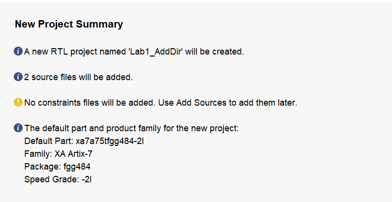
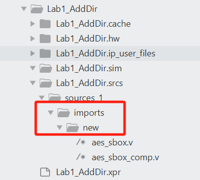
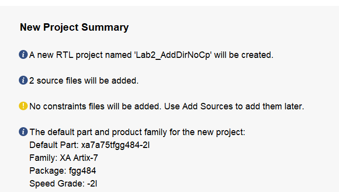
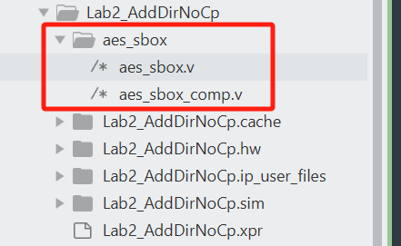
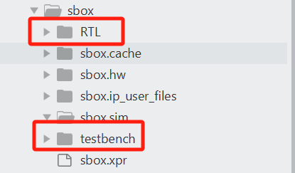

## Vivado 101
### Lab 1
  - Project Name
  - Project Type
  - Add source
  	+ Add directories
  		* Index, Name, Library, HDL Source For, Location
  	+ [x] Copy sources into project
  - Add constraints (optional)
  - Default Part
  - New Project Summary

Result:

### Lab 2
  - Project Name: Lab2_AddDirNoCp
  - Project Type: RTL
  - Add source
  	+ Add directories
  		* Index, Name, Library, HDL Source For, Location
  	+ [ ] Copy sources into project
  - Add constraints (optional)
  - Default Part
  - New Project Summary

Result:

### Lab 3
  - Project Name: sbox
  	+ [x] create project subdirectory
  - Project Type: RTL
  	+ [x] Do not specify sources at this time
  - Default Part
  - New Project Summary
  - Add design soure into the root directory of your project
  - Source panel > add source
  	+ Add or Create Design Sources
  	+ add or create simulation sources

Result:

### how to change simulation top file?
  Flow Navigator > right click SIMULATION > simulation settings > simulation top module name

  Note it is module name which matters rather than name of testbench file.
